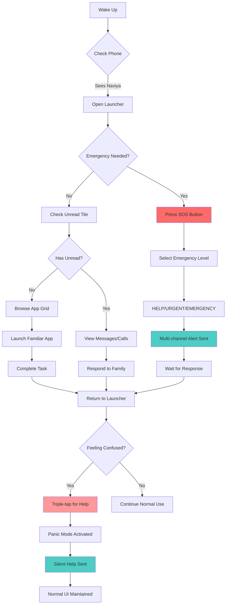
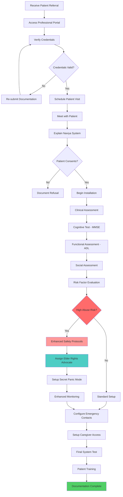
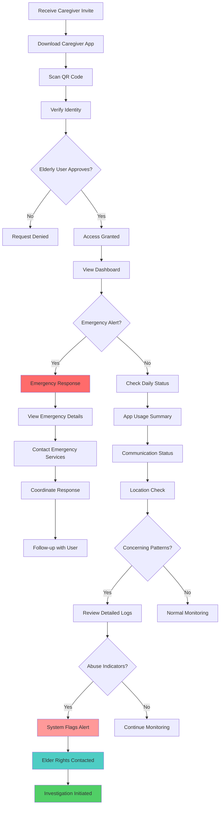
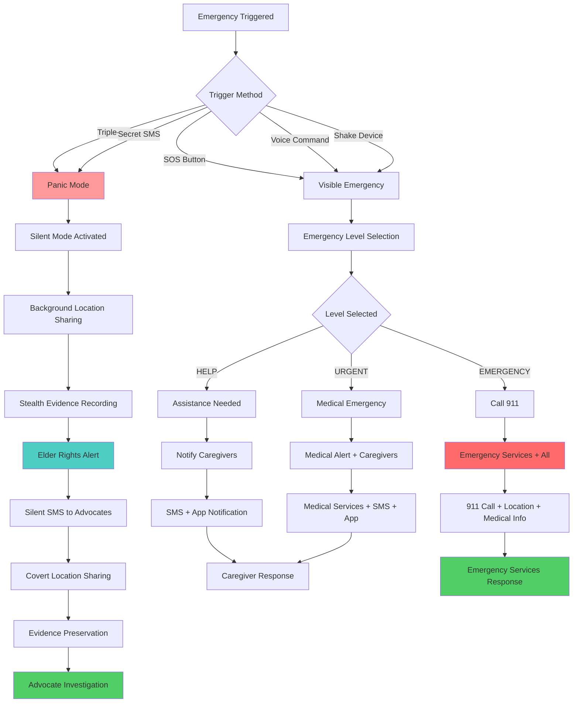

# 🏥 Naviya User Flow Diagrams
*Understanding User Behaviour Through Visual Workflows*

## 👥 Primary User Types & Their Journeys

### 1. 👴 Elderly User - Daily Interaction Flow

### 2. 👨‍⚕️ Healthcare Professional - Installation Flow

### 3. 👨‍👩‍👧‍👦 Family Caregiver - Monitoring Flow

### 4. 🚨 Emergency Response Flow - Critical Path

## 🎨 User Behaviour Insights

### Elderly User Patterns:
- **Routine-driven**: Same apps, same times
- **Safety-first**: Emergency access always visible
- **Simplicity**: Maximum 6 tiles, large touch targets
- **Confusion recovery**: Triple-tap help mechanism

### Caregiver Behaviour:
- **Alert-responsive**: Immediate emergency response
- **Pattern-watching**: Daily usage monitoring
- **Boundary-respecting**: Limited access by design
- **Abuse-aware**: System flags concerning patterns

### Professional Workflow:
- **Assessment-focused**: Clinical evaluation first
- **Safety-prioritised**: Abuse risk evaluation
- **Documentation-heavy**: Compliance requirements
- **Patient-centred**: User autonomy preserved

## 📊 Behavioural Decision Points

### Critical User Decisions:
1. **Emergency vs Normal Use** - Primary split in user journey
2. **Consent to Monitoring** - Elderly user maintains control
3. **Abuse Risk Assessment** - Professional evaluation
4. **Panic Mode Activation** - Silent help mechanism

### System Response Patterns:
- **Graduated Emergency Response** - HELP → URGENT → EMERGENCY
- **Silent Protection Mode** - Invisible abuse prevention
- **Automatic Escalation** - Pattern-based risk detection
- **Multi-channel Communication** - Redundant alert systems

## 🔍 User Testing Scenarios

Based on these flows, key testing scenarios should include:

1. **Elderly User Confusion Recovery**
2. **Emergency Response Time Validation**
3. **Caregiver Boundary Enforcement**
4. **Abuse Pattern Detection Accuracy**
5. **Professional Installation Compliance**

---

*These diagrams prioritise user behaviour understanding and can be rendered interactively in GitHub, documentation systems, or presentation tools.*
